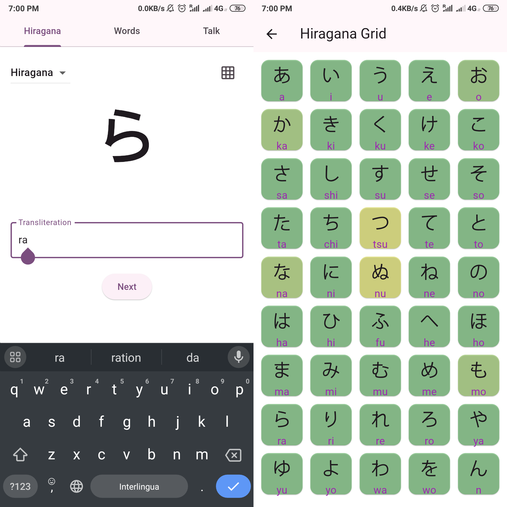

# JapApp

A Flutter app to practice and learn japanese.

# Features

The app should provide three main features:
- Learn scripts (hiragana, katakana, kanjis)
- Practice words, phrases
- Conversate (with an LLM)

At the moment, only the first feature is implemented.

## Scripts

A flash-card like system provides a random character that the user has to match with its transliteration. The inverse will also be available in the future, to match a transliteration with the correct character. 

Given a set of ordered characters, the next one is randomly drawn from the smallest subset (always starting with the first character) in which the average accuracy is < 80%, and where each character has been seen at least 3 times. These values have been choosen empirically.

At each sample, statistics are collected such as correct answers and total number the character was seen. These are persisted as SharedPreferences.

## License

This project is licensed under [Apache 2.0 License](LICENSE)